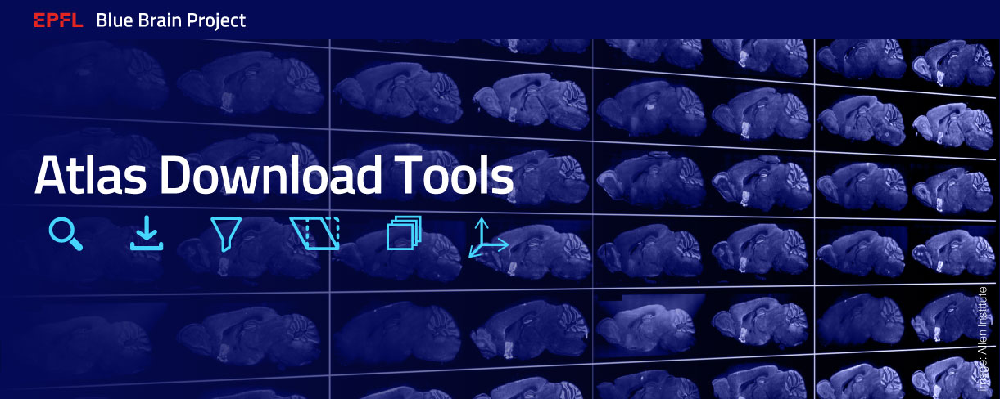

<p align="center">
    
</p>

<h4 align="center">Search, download, and prepare atlas data.</h4>

<p align="center">
    <a href="https://github.com/BlueBrain/Atlas-Download-Tools/releases"></a>
    <a href="https://doi.org/10.5281/zenodo.5195345"></a>
    <a href="https://github.com/BlueBrain/Atlas-Download-Tools/blob/main/LICENSE.txt"></a>
    <br />
    <a href="https://github.com/psf/black"></a>
    <a href="https://pycqa.github.io/isort/"></a>
    <a href="http://www.pydocstyle.org/"></a>
    <a href="https://flake8.pycqa.org/"></a>
    <a href="http://mypy-lang.org"></a>
    <br />
    <a href="https://github.com/BlueBrain/Atlas-Download-Tools/actions/workflows/run-tests.yml"></a>
    <a href='https://atlas-download-tools.readthedocs.io/en/latest/?badge=latest'></a>
</p>

Among different sources of data, Allen Brain Institute hosts a rich database of
gene expression images, Nissl volumes, and annotation atlases.
The Atlas-Download-Tools library can help you to download single section images
and entire datasets, as well as the corresponding metadata.
It can further pre-process the image data to place it in the standard reference space.

* [Installation](#installation)
    * [Installation from PyPI](#installation-from-pypi)
    * [Installation from source](#installation-from-source)
    * [Installation for development](#installation-for-development)
* [How to use the package](#how-to-use-the-package)
    * [Using the CLI](#using-the-cli)
    * [Using the python API](#using-the-python-api)
* [Funding & Acknowledgment](#funding-acknowledgment)

## <a name="installation"></a> Installation


### <a name="installation-from-pypi"></a> Installation from PyPI
The atldld package can be easily installed from PyPI.

```shell script
pip install atldld
```


### <a name="installation-from-source"></a> Installation from source
If you want to try the latest version, you can install from source.
```shell script
pip install git+https://github.com/BlueBrain/Atlas-Download-Tools
```

### <a name="installation-for-development"></a> Installation for development
If you want a dev install, you should install the latest version from source with
all the extra requirements for running test.
```shell script
git clone https://github.com/BlueBrain/Atlas-Download-Tools
cd Atlas-Download-Tools
pip install -e '.[dev]'
```

## <a name="how-to-use-the-package"></a> How to use the package
Atlas-Download-Tools can be used through a command line interface (CLI), as well
as programmatically through a python API.

At present the CLI is rather limited, but we are working on adding the most
useful functionality as soon as possible.

### <a name="using-the-cli"></a> Using the CLI
All functionality can be accessed through the `atldld` command and its
sub-commands. For example:
```bash
$ atldld

# Information about the version of atldld
$ atldld info version
$ atldld info version --help
# Information about the cache folder 
$ atldld info cache
```

One can also get dataset information through the CLI.
```bash
$ atldld dataset info $DATASET_ID
$ atldld dataset preview $DATASET_ID
```

To download a dataset use the `atldld download` command.
```shell
$ atldld download dataset $DATASET_ID
```

For further information please refer to the help part of the corresponding
command.

### <a name="using-the-python-api"></a> Using the python API
The package `atldld` has several functionalities to download data from [Allen Brain Institute](https://portal.brain-map.org/):

- One can find dataset IDs from a gene expression name:
```python
from atldld.utils import get_experiment_list_from_gene
dataset_ids = get_experiment_list_from_gene("Pvalb", axis='sagittal')
```

- One can download any dataset from a dataset ID:
```python
from atldld.sync import DatasetDownloader
downloader = DatasetDownloader(dataset_id=DATASET_ID, **kwargs)
# One needs to fetch metadata before downloading a dataset.
downloader.fetch_metadata()
dataset = downloader.run()
image_id, section_number, img, img_exp, df = next(dataset)
```
Note that this functionality makes a simplifying assumption that
the slices are perfectly parallel to one of the 3 axes.

- One can obtain metadata of a dataset:
```python
from atldld.utils import CommonQueries, get_3d
# The axis {'sagittal', 'coronal'}
axis = CommonQueries.get_axis(dataset_id=DATASET_ID)
# The reference space
ref_space = CommonQueries.get_reference_space(dataset_id=DATASET_ID)
# The 3d transformation of the dataset
matrix_3d = get_3d(dataset_id=DATASET_ID)
```

## <a name="funding-acknowledgment"></a> Funding & Acknowledgment

The development of this software was supported by funding to the Blue Brain Project, a research center of the École polytechnique fédérale de Lausanne (EPFL), from the Swiss government’s ETH Board of the Swiss Federal Institutes of Technology.

Copyright (c) 2021-2022 Blue Brain Project/EPFL
