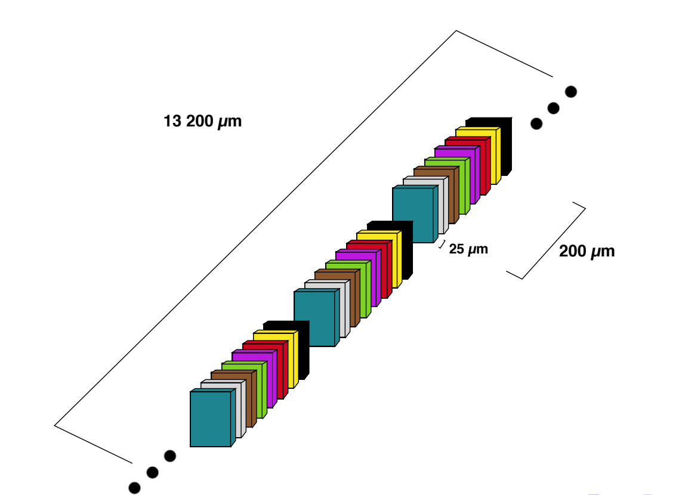
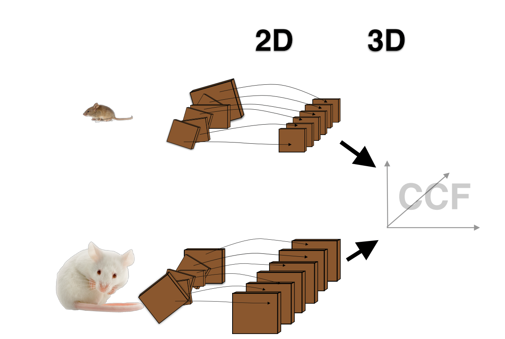

Getting started
===============

Allen Brain Institute hosts a rich database of gene expression images. Additionally, it provides metadata for
each of them. We can leverage this metadata to extract initial registration.

Before delving into the programming interface let us first describe some fundamental concepts of the database.

Concepts
--------
Each :code:`SectionDataSet` contains multiple :code:`SectionImage`. Note that they are often separated by gaps
of equal size. See below a typical coronal section dataset.

The current reference space 9 has dimensions (coronal=13200, 8000, 11400) in microns. Note that we are mostly
interested in the 25 micron atlas with dimensions (528, 320, 456).

Allen Brain provides metadata that enable us to register each experiment. Note that this registration is not always
perfect and that is the main motivation behind this project.

The Allen registration conists of 2 steps

1. Each :code:`SectionImage` has its 2D affine matrix
2. Each :code:`SectionDataSet` has its 3D affine matrix

Useful links
------------

 - QueryBuilder_ - building queries to access allen metadata

.. _QueryBuilder: http://api.brain-map.org/examples/rma_builder/rma_builder.html

Programming interface
---------------------
:code:`atldld` provides a very simple interface for using the Allen API module.

Single image download
~~~~~~~~~~~~~~~~~~~~~
.. testcode::

    import matplotlib.pyplot as plt

    from atldld.utils import get_image

    image_id = 101321610
    img = get_image(image_id)
    print(img.shape)  # (2656, 2856, 3)

.. testoutput::
   :hide:
   :options: -ELLIPSIS, +NORMALIZE_WHITESPACE

   (2656, 2856, 3)

Full-blown synchronization
~~~~~~~~~~~~~~~~~~~~~~~~~~
The most useful function is the :code:`download_parallel_dataset`.
It expects the user to specify the unique :code:`dataset_id`. It returns a
generator. Each iteration then yields

1. **Image id** (unique identifier)
2. **Coronal section** (a number in [0, 13200])
3. **Original image** (high resolution before registration)
4. **Displacement field** (its shape depends on the :code:`downsample_ref` downsampling factor)

.. testcode::

    from atldld.sync import download_parallel_dataset

    dataset_id = 909
    data_gen = download_parallel_dataset(dataset_id, downsample_ref=25)

    image_id, p, img, df = next(iter(data_gen))
    img_reg = df.warp(img)

To register the image one simply warps the original image with the displacement field. Let us list a few important
facts about the logic of :code:`download_dataset`.

- Coronal section is approximate and is implied by a single point :code:`p_detection_xy`
- The downsampling factor :code:`downsample_ref` determines the final shape of the displacement field. By default it is 25.
- The synchronization process is implemented locally to avoid extremely slow per pixel API calls

